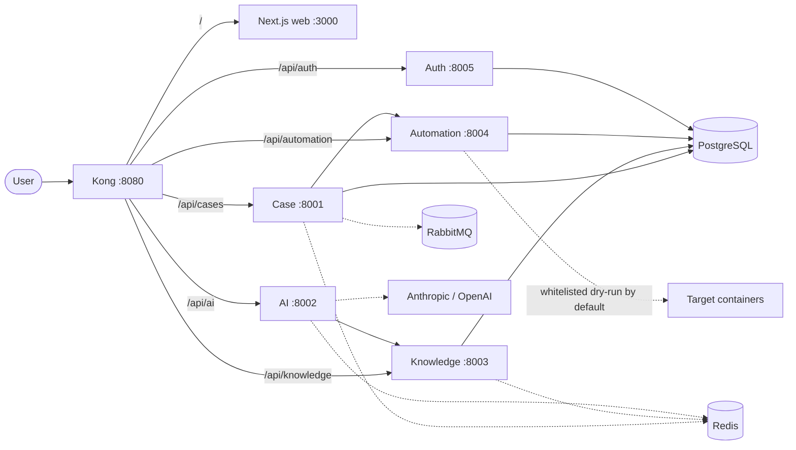

# reTedAI

AI-assisted operations case management, retrieval, diagnosis, and guarded automation. The monorepo contains a Kong API gateway, Next.js UI, five FastAPI services, PostgreSQL with pgvector, Redis, and RabbitMQ.

> Contributors and AI assistants must read [`CLAUDE.md`](CLAUDE.md) before changing the repository.

## Architecture



Dotted edges are optional dependencies. Redis is a cache-aside layer and RabbitMQ carries
fire-and-forget events, so neither is required for a request to succeed — the stack
degrades in latency rather than failing.

## Caching

Redis runs on port `6379` with `allkeys-lru` eviction. Each service owns a logical
database and never reads another service's keys.

| Service | Redis DB | Cached | TTL |
| --- | --- | --- | --- |
| case | 0 | `cases:list`, `case:{id}` | 30s / 60s, deleted on write |
| knowledge | 1 | `emb:{hash}`, `search:{hash}` | 24h / 5m |
| ai | 2 | `analysis:{hash}` | 2m |

Embedding vectors are deterministic for a given input, so `emb:{hash}` carries the long
TTL and removes a provider round trip on every repeated query. Case reads use short TTLs
plus explicit invalidation, because a stale timeline after an approval is a visible bug.

Each service builds from its own Docker context, so the cache helper lives in each
service's `app/cache.py` rather than in a shared module. Every call fails open: a
`RedisError` falls through to the underlying query, and an unset or unreachable
`REDIS_URL` disables caching rather than failing startup. A cache that takes the
application down with it is worse than no cache.

Redis is declared with `condition: service_started` rather than `service_healthy`, so a
cache problem cannot cascade into the gateway refusing to start.

## Data

All services currently share the `retedai` database with a single role. Schema separation
per service is deliberate future work, not a claim the current stack makes. `db/init/`
installs the pgvector extension and creates the tables; each service defines its own
models against that schema.

## Project structure

```text
reTedAI/
├── docker-compose.yml
├── gateway/kong.yml             # Kong DB-less routes and plugins, port 8080
├── scripts/smoke_test.py        # browser-gateway-service path validation
├── web/                         # Next.js UI, port 3000
│   ├── app/                     # pages and development-fallback route handlers
│   ├── components/
│   └── lib/                     # service client and session seam
├── services/
│   ├── auth/                    # development sessions + Keycloak seam, port 8005
│   ├── case/                    # case lifecycle, port 8001
│   ├── ai/                      # RAG and LLM seam, port 8002
│   ├── knowledge/               # hybrid retrieval, port 8003
│   └── automation/              # whitelist and audit, port 8004
├── db/
│   ├── init/                    # pgvector extension and tables
│   └── seed/                    # fake cases, runbooks, loader
├── docs/
│   ├── architecture.md
│   ├── api-contracts.md
│   └── demo-script.md
└── .github/workflows/ci.yml
```

## Quick start

```bash
cp .env.example .env
docker compose up --build
```

Wait until every container is healthy:

```bash
docker compose ps
```

Open the application through Kong at `http://localhost:8080`. Direct Next.js access remains available at `http://localhost:3000` for frontend development. The auth API runs on port `8005`, Kong's admin API is bound locally at `http://localhost:8006`, Redis listens on `6379`, and RabbitMQ management is available at `http://localhost:15672`.

Load the fake cases and runbooks after the services are healthy:

```bash
python db/seed/load_seed.py
```

Verify the complete browser-gateway-service flow:

```bash
python scripts/smoke_test.py
```

Inspect or clear the cache during development:

```bash
docker compose exec redis redis-cli -n 1 keys 'emb:*'
docker compose exec redis redis-cli flushall
```

Stop the stack without deleting its database volume:

```bash
docker compose down
```

## Run independently

Every component is Docker-first. Start one service with only its declared dependencies:

```bash
docker compose up --build case       # also starts PostgreSQL, RabbitMQ, and Redis
docker compose up --build auth       # also starts PostgreSQL
docker compose up --build ai         # also starts knowledge, PostgreSQL, and Redis
docker compose up --build knowledge  # also starts PostgreSQL and Redis
docker compose up --build automation # also starts PostgreSQL
docker compose up --build web        # starts the web dependency chain
```

Run each service's tests inside the same image used by Compose:

```bash
docker compose run --rm auth python -m pytest -q
docker compose run --rm case python -m pytest -q
docker compose run --rm ai python -m pytest -q
docker compose run --rm knowledge python -m pytest -q
docker compose run --rm automation python -m pytest -q
```

Run a service image with no Compose dependencies when testing its standalone starter behavior:

```bash
docker build -t retedai-case ./services/case
docker run --rm -p 8001:8001 retedai-case
```

Equivalent commands work for `ai`, `knowledge`, `automation`, and `auth` using ports `8002`, `8003`, `8004`, and `8005`. The starter implementations boot without external dependencies: unavailable integrations use their documented local seams, an unset `REDIS_URL` disables caching, development auth must be explicitly enabled, and automation stays in dry-run mode.

Service health endpoints intentionally check nothing but the process itself. Kong waits on
every service being healthy before it starts, so a health check that touches PostgreSQL,
Redis, RabbitMQ, or a model provider would take the entire gateway down with it.

For host-based frontend development:

```bash
cd web
npm ci
npm run dev
```

For host-based FastAPI development (replace `case` and its port as needed):

```bash
cd services/case
python -m venv .venv
source .venv/bin/activate
python -m pip install -r requirements.txt
python -m uvicorn app.main:app --reload --port 8001
```

## Tests

```bash
cd web && npm ci && npm run build && cd ..
for service in services/*; do (cd "$service" && python -m pytest -q); done
docker compose config --quiet
python scripts/smoke_test.py
```

Caching services cover two additional cases: a cache hit returns without touching the
source, and a simulated `RedisError` still returns correct data.

The smoke test expects the Compose stack and seed data to be running. See [`CLAUDE.md`](CLAUDE.md) for the full validation contract and [`docs/demo-script.md`](docs/demo-script.md) for the verified demo path.

See the [Docker development guide](docs/docker-development.md), [API contracts](docs/api-contracts.md), [architecture notes](docs/architecture.md), and the [demo script](docs/demo-script.md).
