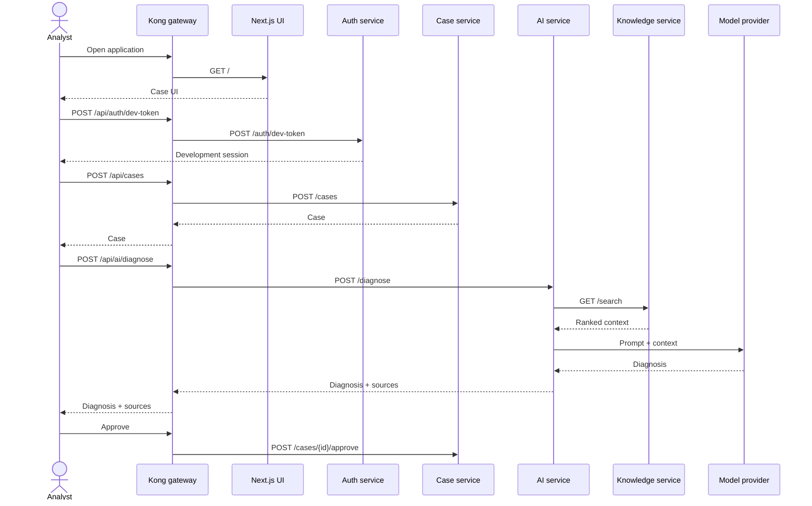

# Architecture

The browser talks to Kong, which runs in DB-less mode from `gateway/kong.yml`. Kong sends page and asset requests to Next.js and routes `/api/auth`, `/api/cases`, `/api/ai`, `/api/knowledge`, and `/api/automation` directly to their owning FastAPI services. Route handlers under `web/app/api` remain compatible fallbacks for developers accessing Next.js directly on port 3000.

The auth service owns development sessions and is the future Keycloak verification boundary. The case service owns the operational record and emits `case.created` events through a RabbitMQ seam. The AI service retrieves context from knowledge, builds a constrained prompt, and calls Anthropic or OpenAI when configured; otherwise it returns a deterministic local response. Knowledge combines keyword scoring with a local embedding seam, ready to move to the provisioned pgvector schema. Automation accepts only named actions from its whitelist and remains dry-run unless explicitly enabled.

Kong currently injects a deterministic demo user and approver role on the case route so the starter approval flow works. The auth service's opaque development sessions and those injected headers are explicitly Keycloak seams, not production authentication. Redis is provisioned as an optional cache-aside layer with `allkeys-lru` eviction. Case, knowledge, and AI each receive their own logical database through `REDIS_URL` (`/0`, `/1`, `/2`) and never read another service's keys. Every cache call is designed to fail open, so an unset or unreachable Redis costs latency rather than availability, and Compose uses `condition: service_started` so a cache problem cannot block Kong. The service-side cache helpers (`app/cache.py`) are not implemented yet; today the services receive `REDIS_URL` but do not use it. See the Caching section of the README for keys and TTLs. PostgreSQL initializes `auth_svc`, `case_svc`, `knowledge_svc`, and `automation_svc` schemas plus the `vector` extension. Current repositories are deliberately in-memory seams; persistence migrations can be added without changing public API contracts.
