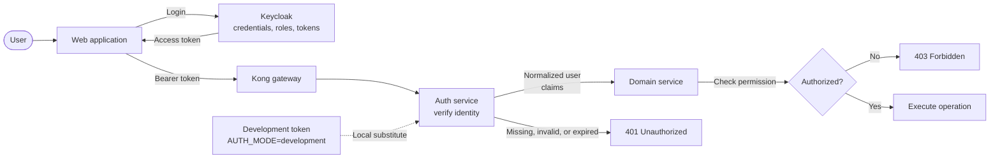

# Authentication Architecture

This document defines the authentication boundary for reTedAI. Authentication answers **who is making a request**. Authorization answers **whether that user may perform the requested operation**.

## Ownership

### Auth service

The auth service owns the application's identity boundary:

- Verify a bearer token, either through the development session store or by validating a Keycloak access token.
- Return the normalized user information needed by the application: stable user ID, email, display name, and assigned roles.
- Expose the current identity through `GET /auth/me`.
- Reject missing, malformed, invalid, or expired credentials with `401 Unauthorized`.
- Revoke development sessions and coordinate logout behavior for Keycloak sessions.

The auth service does not decide whether a user may approve a case, execute automation, or perform another domain operation. It supplies verified identity and claims to the service that owns that operation.

### Keycloak

Keycloak is the identity provider for non-development authentication. It owns:

- User credentials and credential policies.
- Login, logout, token issuance, refresh, and single sign-on flows.
- User lifecycle and account state.
- Realm/client configuration.
- Group and role assignment.

Keycloak is the source of truth for the claims in an access token. Application services must not accept user identity supplied only in request headers or request bodies.

### Domain services

Each service owns authorization for its own operations. A service must:

1. Obtain the verified current user from the auth boundary.
2. Check the user's role and any resource-specific rules.
3. Return `403 Forbidden` when the identity is valid but lacks permission.
4. Keep authorization close to the operation it protects.

Examples:

- The case service decides who may create, update, approve, or view a case.
- The automation service decides who may request an automation action and applies its whitelist and execution policy.
- The knowledge service decides which search or knowledge-management operations each role may use.
- The AI service decides which AI operations are available to an authenticated user.

A role is an input to an authorization decision, not proof that the operation is allowed by itself. Resource ownership, case state, and other domain constraints remain the responsibility of the owning service.

## Request flow

The intended production flow is:

1. The user signs in through Keycloak.
2. Keycloak returns an access token to the web application.
3. The web application sends the token as `Authorization: Bearer <token>` when calling Kong and backend services.
4. The auth boundary verifies the token signature, issuer, audience/client, time claims, and required claim shape.
5. The auth boundary maps verified claims to the application's normalized user model.
6. The target domain service performs its own authorization check.
7. The service executes the operation or returns `401`/`403` as appropriate.

Kong may route traffic and enforce coarse gateway policy, but it must not manufacture an identity by injecting `x-user-id` or `x-user-role`. Those headers are not an authentication mechanism.

## Development authentication

Development authentication is an explicit local-only substitute for Keycloak:

- It is enabled only when `AUTH_MODE=development`.
- `POST /auth/dev-token` issues a random in-memory token with a one-hour lifetime.
- The token resolves through the auth service's in-memory session store.
- `DELETE /auth/session` removes the development session immediately.
- Restarting the auth service invalidates all development sessions.

Development tokens are useful for local tests and the starter stack, but they do not model Keycloak credential storage or a production login flow. They must never be enabled as a production authentication mode, and development endpoints must not be exposed as a substitute for Keycloak login.

The web application and gateway should use this mode only behind an explicit development configuration. They must not silently fall back to a fixed demo identity when no token exists.

## Keycloak authentication

In Keycloak mode, the auth boundary should validate access tokens using Keycloak's issuer metadata and signing keys. Validation must include at least:

- Signature and signing-key validity.
- Trusted issuer.
- Intended audience/client.
- `exp` and, where applicable, `nbf` and `iat` time claims.
- A stable subject (`sub`) for the application user ID.
- The mapped role or group claims required by the application.

The application should map Keycloak claims to its `User` representation without accepting role values supplied independently by the browser. Role names and claim mapping should be configured centrally and documented alongside the Keycloak client configuration.

## Expiration, logout, and failures

### Token expiration

An expired access token is an authentication failure. The auth boundary returns `401 Unauthorized`, removes expired development sessions, and does not attempt to infer a user from stale headers or cached UI state. The web application should clear its local session and begin the configured login or development-token flow again.

Access-token lifetime should remain short enough to limit exposure. Refresh tokens, when used, belong to the Keycloak/web session flow and must not be forwarded to domain services.

### Logout

Logout has two parts:

- The web application clears its local token and session state.
- Keycloak-backed sessions use the Keycloak logout/end-session flow so the provider session is ended as well.

For development authentication, the web application calls `DELETE /auth/session` before clearing its local state. For self-contained bearer access tokens, logout cannot retroactively erase a token already copied by a client; short expiration, secure storage, and provider-side session revocation limit that window.

### Authentication versus authorization errors

- `401 Unauthorized`: credentials are missing, malformed, invalid, expired, or issued by an untrusted provider. The client may authenticate again.
- `403 Forbidden`: the token is valid and identifies the user, but the user is not allowed to perform the requested operation. Re-authentication does not change this decision.

Services should avoid returning detailed token-validation reasons to callers. Logs may include a correlation ID and safe failure category, but must not contain access tokens or credentials.

## Removing hardcoded demo identities

The current starter implementation contains deliberate development shortcuts. Remove or isolate them as Keycloak support becomes active:

1. Replace the web fallback in `web/lib/session.ts` with a real session/token source. Do not return `demo-user`, `Demo Analyst`, or a default role when no session exists.
2. Replace `sessionHeaders()` with `Authorization: Bearer <access-token>`. Do not forward browser-provided `x-user-id` or `x-user-role` as identity.
3. Remove Kong's case-route request transformer that injects `x-user-id:demo-user` and `x-user-role:approver`.
4. Change `services/case/app/deps.py` to validate the bearer token and map verified claims. Remove the `local-user`, `analyst`, and arbitrary header defaults.
5. Keep `services/auth/app/models.py` development request defaults only for explicitly enabled local token issuance, or require all fields in local environments that test identity selection. Never use those defaults in Keycloak mode.
6. Add the Keycloak issuer, audience/client, JWKS, and role-claim configuration through environment or deployment configuration, not source-code constants.
7. Update tests and the smoke test to obtain a development token explicitly in development mode or use a test Keycloak issuer. Add tests for missing, invalid, expired, and insufficient-role requests.
8. Ensure every backend route that needs identity uses the same verified-user dependency. No service should trust identity headers merely because they came through Kong.

The removal is complete when an unauthenticated request cannot become `demo-user`, `local-user`, or another default identity through any web, gateway, or backend code path, and when authorization decisions are made from verified claims by the owning service.
