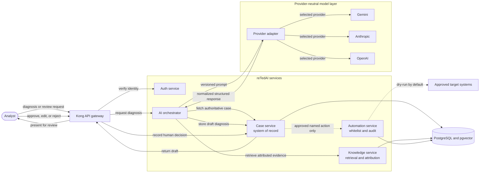

# reTedAI AI service

The AI service coordinates retrieval-augmented diagnosis generation. It is an
orchestrator: it gathers authoritative case context and supporting evidence,
calls a configured model provider, validates the result, and returns a draft for
human review. It must never approve or execute remediation.

## Current implementation

The current service provides `POST /diagnose`, retrieves context from the
Knowledge service, constructs a constrained prompt, and directly calls Anthropic
or OpenAI when configured. Without either provider key, it returns a deterministic
local fallback.

This is a starter implementation. Gemini support, provider-neutral adapters,
structured diagnoses, durable diagnosis history, and production observability
described below remain planned work.

## Target architecture

Keep the existing service boundaries while making the AI workflow explicit,
provider-neutral, and auditable. Prefer logical modules inside the existing
services over additional deployable microservices until the core workflow is
reliable.

### Architecture at a glance

The diagram below shows the target diagnosis and approval boundaries. Solid
arrows represent synchronous requests or persisted state changes; the dotted
arrow represents a guarded action that is possible only after human approval.

### AI orchestrator

The AI service should:

- Receive a diagnosis request containing a `case_id` and the analyst's question.
- Retrieve authoritative case details from the Case service.
- Request relevant evidence from the Knowledge service.
- Construct a versioned prompt.
- Select and call a configured provider through a provider-neutral interface.
- Validate the response against a structured diagnosis contract.
- Return citations, confidence indicators, warnings, and model-run metadata.
- Never execute remediation directly.

The AI service does not own cases, documents, permissions, approvals, or
automation execution.

### Knowledge and RAG

The Knowledge service owns the complete retrieval lifecycle:

- Document ingestion, normalization, and chunking.
- Embedding generation and PostgreSQL/pgvector persistence.
- Keyword and vector retrieval with metadata filtering.
- Optional reranking when evaluation results justify it.
- Source and chunk attribution.

The AI service should receive evidence objects containing source IDs, titles,
excerpts, and relevance scores instead of anonymous text strings.

### Model-provider layer

Provider-specific behavior belongs behind one internal interface so Gemini,
Anthropic, OpenAI, and future providers do not change the orchestration flow. The
provider layer is responsible for:

- Explicit provider and model selection.
- Model configuration and provider-specific request formatting.
- Timeouts, bounded retries, and rate-limit handling.
- Normalized responses and errors.
- Token, latency, and cost measurement.
- Explicit, safe provider fallback rules.

A fallback must always be recorded. The service must not silently substitute a
different provider or lower-quality model.

### Structured diagnosis

A diagnosis is a versioned, typed artifact rather than one unstructured
paragraph. Its contract should include:

- Summary.
- Observed evidence.
- Hypotheses.
- Recommended verification steps.
- Proposed remediation.
- Risks and confidence.
- Attributed sources.
- Provider, model, and prompt version.
- Generation timestamp.

This contract provides a stable boundary for the UI, persistence, provider
adapters, and tests.

### Case ownership and human approval

The Case service remains the system of record for case status, diagnosis
versions, analyst comments, approval or rejection, timeline events, and the
approved remediation plan. The AI service creates a draft diagnosis; it cannot
approve its own output.

### Guarded automation

Automation remains isolated from model execution:

1. The AI service proposes a named remediation action.
2. The proposal must map to a predefined Automation service whitelist entry.
3. A human reviews and approves the proposal.
4. The Automation service independently validates the user's permissions,
   target, parameters, and case approval.
5. Execution remains a dry run by default.
6. Every attempt and result is written to a durable audit trail.

The model must never submit or execute arbitrary commands.

### Security boundary

Kong remains the external gateway. The current development identity injection
must be replaced with verified authentication before production use. Internal
requests should forward verified identity and role claims, and authorization to
generate a diagnosis must remain separate from authorization to approve or run
remediation.

Provider credentials stay server-side. The AI service must redact secrets and
sensitive data before provider calls, verify access to the requested case before
retrieval or generation, and treat retrieved documents as untrusted input to
reduce prompt-injection risk.

### Reliability and observability

Each diagnosis request should have a correlation ID and record:

- Case and user IDs.
- Retrieval duration and retrieved source IDs.
- Prompt version, provider, and model.
- Model latency, token usage, and estimated cost.
- Validation and grounding outcomes.
- Retry or fallback events.
- Final request status.

Full prompts and provider responses should not be logged by default because they
may contain sensitive operational data.

## Proposed diagnosis flow

1. An analyst requests a diagnosis for a case.
2. Kong authenticates the analyst and forwards verified identity claims.
3. The AI orchestrator fetches the case from the Case service.
4. The AI orchestrator requests relevant evidence from the Knowledge service.
5. The Knowledge service performs hybrid retrieval and returns attributed chunks.
6. The AI orchestrator builds a versioned, injection-resistant prompt.
7. The provider layer calls the selected model.
8. The response is parsed and validated against the diagnosis contract.
9. Grounding rules check that factual claims have supporting sources.
10. The Case service stores the diagnosis as a draft version.
11. An analyst reviews, edits, approves, or rejects the draft.
12. Only an approved remediation can reach the Automation service.

## Failure behavior

The workflow should degrade predictably:

- **Knowledge unavailable:** return a retriable failure or a clearly labeled
  ungrounded result, according to policy.
- **No relevant evidence:** report insufficient evidence instead of inventing an
  answer.
- **Provider unavailable:** retry within a small budget, then use an explicitly
  configured fallback or fail cleanly.
- **Invalid model output:** attempt one bounded repair, then reject the response.
- **Case missing or unauthorized:** stop before retrieval or model invocation.
- **Automation unavailable:** preserve the approved plan without claiming it ran.
- **Partial execution:** record each completed step and require human review
  before retrying.

## Delivery phases

### Phase 1: Safe diagnosis vertical slice

- Define the structured diagnosis contract.
- Fetch authoritative case context in the AI service.
- Return attributed knowledge results.
- Add versioned prompts and a provider-neutral model adapter.
- Persist draft diagnosis versions in the Case service.
- Complete the human review and approval flow.

### Phase 2: Production-quality retrieval

- Persist documents and embeddings in PostgreSQL/pgvector.
- Add chunking and document metadata.
- Implement hybrid retrieval.
- Establish a retrieval evaluation dataset.
- Add reranking only if evaluation shows a meaningful improvement.

### Phase 3: Operational reliability

- Add correlation IDs, metrics, and tracing.
- Define provider retry and fallback policy.
- Record token usage and cost.
- Establish data-redaction and retention policies.

### Phase 4: Guarded remediation

- Introduce structured action proposals.
- Enforce approval and authorization at execution time.
- Validate targets against a managed inventory.
- Preserve dry-run behavior and write durable audit records.

## Architecture decisions

- The Case service is the system of record.
- The AI service is an orchestrator, not an autonomous executor.
- The Knowledge service owns ingestion and retrieval.
- Diagnoses are structured and versioned.
- Model claims should be attributable to evidence.
- Model providers are integrated through adapters.
- Automation is whitelist-only and human-approved.
- Provider fallback is visible and auditable, never silent.
- PostgreSQL/pgvector will replace in-memory knowledge storage.
- Prompt, retrieval, and model changes require evaluation before rollout.
